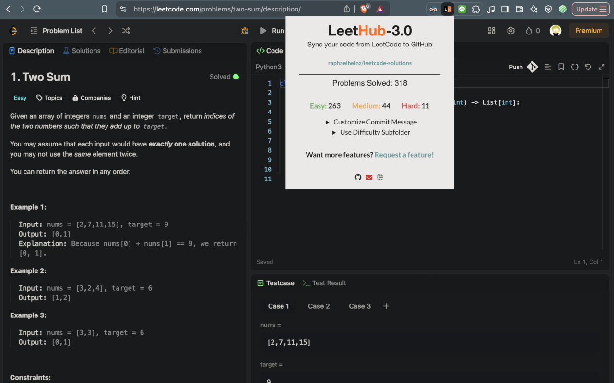

<div align="center">
    
</div>

<p align="center">
  <a href="https://github.com/raphaelheinz/LeetHub-3.0/blob/main/LICENSE">
    
  </a>
  <a href="https://chromewebstore.google.com/u/1/detail/leethub-v3/kdkgpjpenaeoodajljkflmlnkoihkmda">
    
  </a>
  <a href="https://chromewebstore.google.com/u/1/detail/leethub-v3/kdkgpjpenaeoodajljkflmlnkoihkmda">
    
  </a>
  <a href="https://github.com/raphaelheinz/LeetHub-3.0/graphs/contributors" alt="Contributors">
    
  </a>
</p>

## What is LeetHub-3.0?

A chrome extension that automatically pushes your code to GitHub when you pass all tests on a <a href="https://leetcode.com/">Leetcode</a> or <a href="https://leetcode.cn/">Leetcode CN</a> problem. It's forked from <a href="https://github.com/arunbhardwaj/LeetHub-2.0">LeetHub-2.0</a> which is not compatible with Leetcode anymore since the latest updates.


## Why LeetHub?

There's no easy way of accessing your leetcode problems in one place! Moreover, pushing code manually to GitHub from Leetcode is very time consuming. So, why not just automate it entirely without spending a SINGLE additional second on it?

## Screenshot

<h1 align="center">
    
</h1>

## Supported Platforms

LeetHub-3.0 supports both:
- **LeetCode.com** (English)
- **LeetCode.cn** (Chinese/力扣)

## Supported UI

LeetHub-3.0 works with two different Leetcode UIs. There are known issues when using the plugin with the "non-dynamic layout". Please use one of the following:

1. **old layout** or
2. new **"dynamic layout"**


## Manual synchronization

Your submission may not be successfully uploaded to GitHub if you update the text in the editor too fast. It is necessary to wait for 4 seconds (until the spinner stops) after submitting the solution before entering new characters, switching languages, or switching editors. During this period, your solution is being pushed to GitHub, and the website should maintain its layout without alteration. While this process is less than ideal, we have not found a better solution so far. Sorry for this inconvenience! If you find a fix, your PRs are welcome!

In the meantime, we have added a manual synchronization button next to notes icon. Please use the manual sync button only after you have successfully submitted your solution to Leetcode. Additionally, you can push previous submissions to GitHub by selecting the submission first and then click on the manual synchronization button.


## Installation

<div align="center">
    <a href="https://chromewebstore.google.com/u/1/detail/leethub-v3/kdkgpjpenaeoodajljkflmlnkoihkmda" rel="Download leetcode plugin">
        
    </a>
</div>

1. **Chrome Web Store**

    Install this plugin using Chrome Web Store. Please find the link above. This is the preferred way of installation. Updates are installed automatically.


2. **(Optional) Manual installation**

    You can also install the plugin manually. Please follow the steps below.

    * Create your own OAuth app in GitHub (https://github.com/settings/applications/new) and store CLIENT_ID and CLIENT_SECRET confidentially
        * Application name: [CUSTOM]
        * Homepage URL: https://github.com/raphaelheinz/LeetHub-3.0
        * Authorization callback URL: https://github.com/
    * Download the project ZIP (<a href="https://github.com/raphaelheinz/LeetHub-3.0/releases">Releases</a>) or clone this repository
    * Run ```npm run setup``` to install the developer dependencies
    * Update CLIENT_ID and CLIENT_SECRET in ```src/js/authorize.js``` and ```src/js/oauth2.js``` with your ids
    * Go to <a href="chrome://extensions">chrome://extensions</a>
    * Enable <a href="https://www.mstoic.com/enable-developer-mode-in-chrome/">Developer mode</a> by toggling the switch on top right corner
    * Click **"Load unpacked"**
    * Select the entire LeetHub folder


## Setup

1. After installing the LeetHub, launch the plugin
2. Click on **"Authorize with GitHub"** to set up your account with LeetHub
3. Setup an existing/new repository with LeetHub (private by default) by clicking **"Get Started"**
4. Begin Leetcoding! To view your progress, simply click on the extension!


## Supported npm commands

```bash
npm run               # Show available commands
npm run setup         # Install dependencies
npm run format        # Auto-format JavaScript, HTML/CSS
npm run format-test   # Test if code is formatted properly
npm run lint          # Lint JavaScript
npm run lint-test     # Test if code is linted properly
```

## Contribution

Please help to further improve this awesome plugin! We would appreciate your support. Your pull requests are welcome!

Don't forget to star this repository for further development of new features. If you want a particular feature, simply [request](https://github.com/raphaelheinz/LeetHub-3.0/labels/feature) for it!

